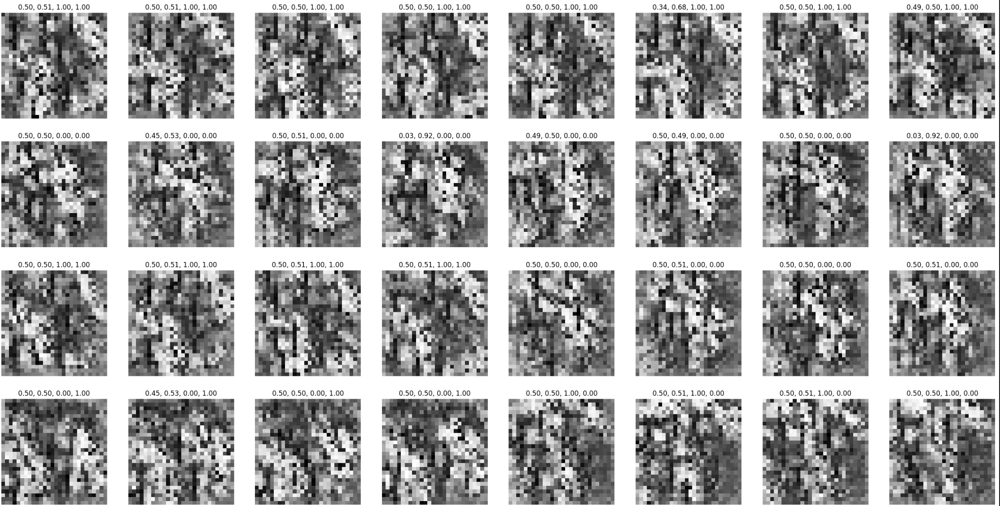

Synthetic data is generated with a transposed CNN with a short optimization loop on a grouping function. A sequence model such as a transformer can be trained on many batches of synthetic data to instill an in-context learning algorithm which picks up on some of the visual differences in an MNIST binary classification task.

Example synthetic data:

